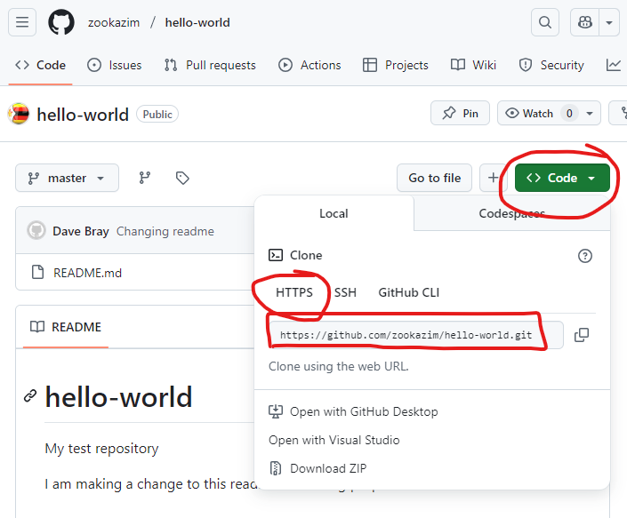
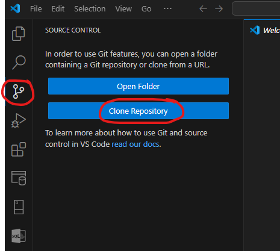
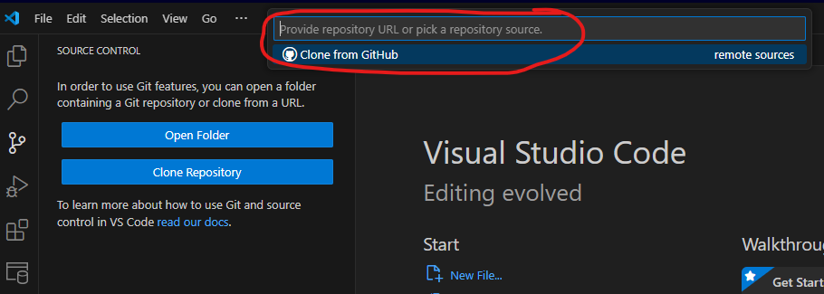

# Git Demo


## 1. Clone Repo Locally (GitBash)

### 1.1 Get URL of repo



### 1.2 Open Gitbash 

```
$ git clone https://github.com/zookazim/hello-world.git
```


    Cloning into 'hello-world'...
    remote: Enumerating objects: 10, done.
    remote: Counting objects: 100% (3/3), done.
    remote: Compressing objects: 100% (2/2), done.
    remote: Total 10 (delta 0), reused 2 (delta 0), pack-reused 7 (from 1)
    Receiving objects: 100% (10/10), done.

```
$ ls

$ cd hello-world
```

```
$ git branch --all

$ git branch NewDemoBranch

$ git branch --all

$ git switch NewDemoBranch
```
    M       README.md
    Switched to branch 'NewDemoBranch'


```
$ git status
```
    On branch NewDemoBranch
    nothing to commit, working tree clean

```
$  git push --set-upstream origin NewDemoBranch
```

```
$  git switch NewDemoBranch
```


```
$  git status
```

    On branch NewDemoBranch
    Changes not staged for commit:
      (use "git add <file>..." to update what will be committed)
      (use "git restore <file>..." to discard changes in working directory)
            modified:   README.md
    
    no changes added to commit (use "git add" and/or "git commit -a")

```
$ vi README.txt

$ cat README.txt

$ git status

$ git add README.md

$ git commit -m "Changed a few things"

```

<br>


## 2. Clone Repo Locally (using VS Code)

### 2.1 Open VS Code and Clone Repo

<br>




<br>




<br>

You may be prompted to login to GitHub if you are not already logged in. When successfully logged in you will be presented with a list of repos to select from


## 3. Create a branch on remote repo (GitHub web page)

"New Branch" button


### 3.2 Check the branch is created from GitBash

```
$ git fetch
From https://github.com/Mental-Health-Commission/Synapse-Analytics-workspace
 * [new branch]        daves_test -> origin/daves_test
```

### 3.3 Create the Branch Locally

```
$ git branch --all
* daves_test_main
  main
  remotes/origin/HEAD -> origin/main
  remotes/origin/b3_wasms/coroners_office
  remotes/origin/b3_wasms/merge_suspected_cases
  remotes/origin/b3_wasms/project_b
  remotes/origin/c2_rmhs/project
  remotes/origin/c3_aodmds/c3_aodmds_notebook_updates
  remotes/origin/c3_aodmds/c3_aodmds_validation_rules_test
  remotes/origin/common/project
  remotes/origin/d1_mns/d1_mns_validation_v2
  remotes/origin/d1_mns/project
  remotes/origin/d2_bedstate/parameters_fixes
  remotes/origin/d6_hmdc/initial_setup
  remotes/origin/daves_test
  remotes/origin/daves_test_main
  remotes/origin/main
  remotes/origin/workspace_publ_prod/deployment_changes
  remotes/origin/workspace_publish
  remotes/origin/workspace_publish_prod

```

### 3.4 Create the Branch Locally

Use the git checkout command to create the branch and track the remote branch.

```
$ git checkout --track origin/daves_test
branch 'daves_test' set up to track 'origin/daves_test'.
Switched to a new branch 'daves_test'
```

Check that the branch has now been created and is in the list of local branches

```
$ git branch --all
* daves_test
  daves_test_main
  main
  remotes/origin/HEAD -> origin/main
  remotes/origin/b3_wasms/coroners_office
  remotes/origin/b3_wasms/merge_suspected_cases
  remotes/origin/b3_wasms/project_b
  remotes/origin/c2_rmhs/project
  remotes/origin/c3_aodmds/c3_aodmds_notebook_updates
  remotes/origin/c3_aodmds/c3_aodmds_validation_rules_test
  remotes/origin/common/project
  remotes/origin/d1_mns/d1_mns_validation_v2
  remotes/origin/d1_mns/project
  remotes/origin/d2_bedstate/parameters_fixes
  remotes/origin/d6_hmdc/initial_setup
  remotes/origin/daves_test
  remotes/origin/daves_test_main
  remotes/origin/main
  remotes/origin/workspace_publ_prod/deployment_changes
  remotes/origin/workspace_publish
  remotes/origin/workspace_publish_prod
```

## 4. Create all locally

### 4.1 Prepare

Switch to main and get latest

```
git fetch
git switch main
git pull
```

### 4.2 Create the branch

```
git branch dir_to_branch/my_new_branch_name
```

### 4.3 Push to remote

```
git push origin -u dir_to_branch/my_new_branch_name
```
