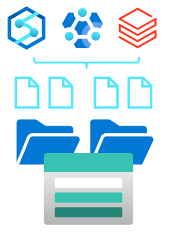

# Azure Data Lake Storage Gen2

## 1. General Setup

Azure Data Lake Storage Gen2 is just standard blob storage with configuration changes. Click "Enable Hierarchical Namespace" when creating a storage account to turn it into Data Lake Gen2 storage.

Or you can use the Data lake Gen2 upgrade wizard if you want to convert an existing storage account.

## 2. Comparing Data Lake Store to Azure Blob storage

### 2.1 Blob storage
- stores large amounts of unstructured data 
- flat or single level hierarchy (ie no directories) 
- you can name the blobs with '/' for virtual folders but still single directory

### 2.2 Data Lake Storage
- builds on blob storage
- optimises I/O of high volume data
- Hierarchical namespace (stores files in directories)
- stores metadata about each directories and the files contained within

### 2.3 Stages for Processing Big Data

- **Ingest** -  identify processes and technology 
- **Store** - identify where the data will go
- **Prep and train** - Azure Synapse Analytics, Azure Databricks, HDInsight, Azure Machine Learning
- **Model and serve** - present data to users. PowerBI etc

## 3. Structuring Data Sets

### 3.1 File Formats

#### Human Readable formats
* JSON
* CSV
* XML

#### Binary formats

These are machine readable, binary and compressed. The schema is stored in the file.

* Avro
  * use where I/O patterns are write heavy
  * use where query patterns favour retrieving multple rows of records in their entirety
* Parquet & Optimised Row Columnar (ORC)
  * use when I/O is more read heavy
  * queries retrieving subset of columns

### 3.2 File Size

Larger files lead to better peformance and reduced costs

## References

| Ref | Description | Link |
| --- | ------------------- | --------------- |
| 1 | Microsoft Learn Training | https://learn.microsoft.com/en-us/training/modules/introduction-to-azure-data-lake-storage/1-introduction |
| 2 | Upload data exercise | https://learn.microsoft.com/en-us/training/modules/upload-data-to-azure-data-lake-storage/|

