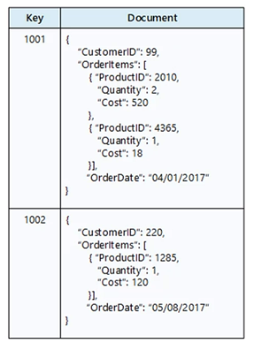
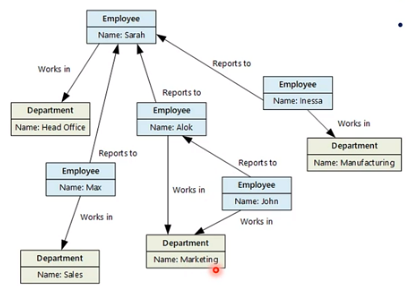
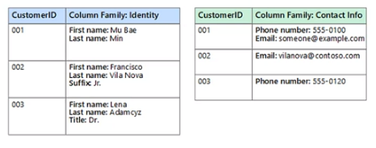
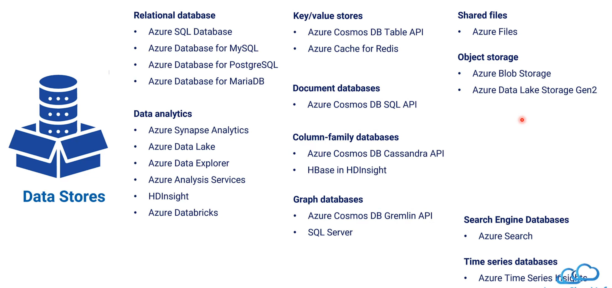

[My Microsoft Azure Home](microsoft_learn_home.md) > [Azure Data Solution Design](azure_data_solution_design.md)

# Data Storage Types

## Relational Database Management Systems (RDBMS)

### Data Structure
* Schema-on-write
* Normalised
* Relationships enforced using database constraints

### Operation

* Structured Query Language (SQL)
* ACID (Atomic, Consistent, Isolated, Durable) for read write consistency

## Key Value Stores

### Data Structure

* Each data value associated with a unique key
* scalable
* no relationship between entities

### Operation

* Simple insert/delete operation
* highly optimised for performing simple lookups

### Examples

* data caching
* session management
* environment variables

### Azure Services

* Azure Cosmos DB
* Azure Cache for Redis

## Document Databases

### Data Structure

* similar to key value
* value contains a document 
* semi structured

### Operation

* individual docs are retrieved and written as a single block
* data requires index on multiple fields

### Examples

* Product catalogue
* content managment

### Azure Services

* Azure Cosmos DB

## Graph Database

### Data Structure

* Stores two types of information, nodes and edges
* nodes similar to table rows or JSON docs
* complex relationship between data items

### Operation

* Efficiently perform queries to analyse Relationships
* data requires indexes on multiple fields

### Examples

* org charts
* social graphs

### Azure Services

* Cosmos DB Gremlin API

## Column-family Databases

### Data Structure

* organises data into rows and columns
* denormalised approach where columns stored together

### Operation 

* read and write operations are atomic for a family of columns
* update and delete are rare

### Examples

* sensor data

### Azure Services

* Azure Cosmos DB Cassandra API

## Data Analytics

### Data Structure

* provide massively parallel solution
* star and snowflake schemas

### Azure Services

* Synapse Analytics
* Data Lake
* Data Explorer
* Analysis Services
* HDInsight
* Databricks

## Object Storage

### Data Structure

* optimised for storing and retrieving large binary objects
* can manage extremely large unstructured data

### Operation 

* identified by key

### Examples

* images, videos
* static HTML
* logs
* database backups

### Azure Services

* Azure Blob Storage
* Azure Data Lake Storage Gen2

## Shared fields

### Data Structure

* file shares can be accessed across the network
* requires SMB
* Cross platform - Windows Linux MacOS

### Operation

* accessible with standard I/O libraries

### Examples

* legacy fields
* shared content accessible via app or VM

### Azure Services

* Azure Files

## Time Series Databases

### Data Structure

* Azure Time Series Insights is built to store, visualise large amounts of time series data

### Operation

* records are appended serially in time
* updates are rare
* deletes occur in bulk

### Examples

* monitoring and event telemetry
* sensor or other IoT data

### Azure Services

* Azure Time Series Insights

## Summary

## Links

