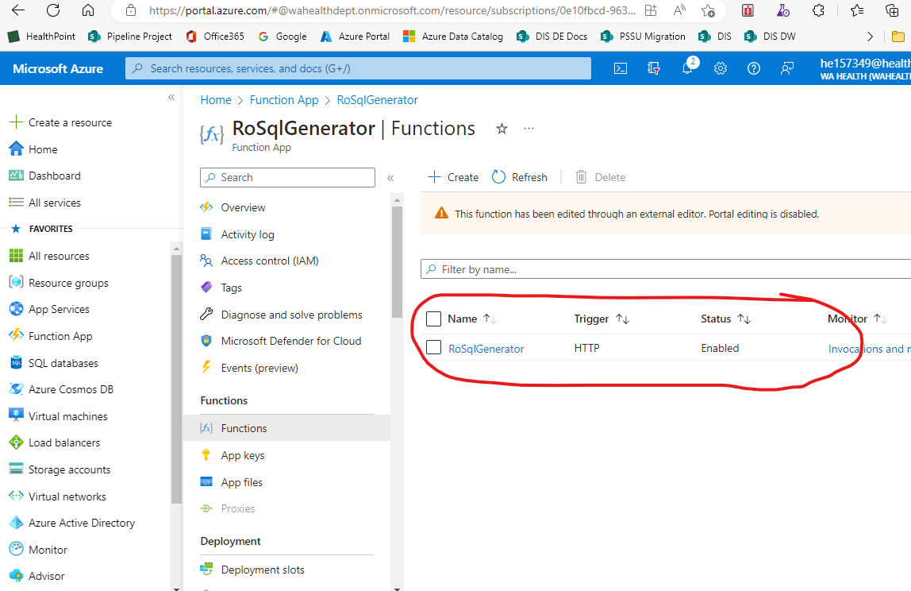
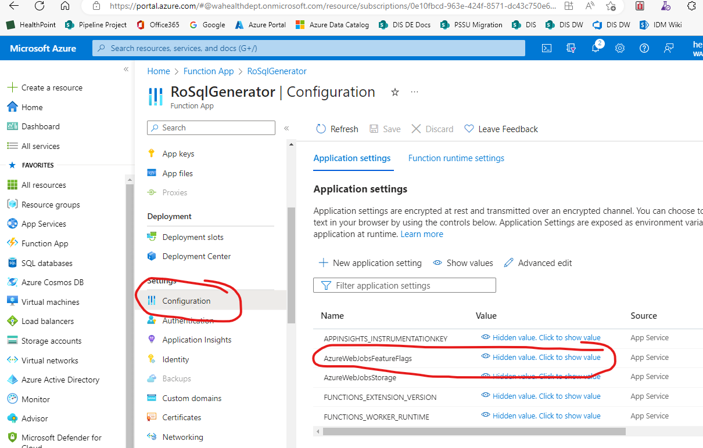

[Microsoft Azure Home](microsoft_learn_home.md)

# My Setup

## Requirements

1. An Azure Account (I'm using Visual Studio subscription)
2. Install Azure Functions Core Tools (done, link below)
3. Install Python (done)
4. "Python" Extension for Visual Studio Code (done)
5. "Azure Functions" extension for Visual Studio Code (done)
6. "Azure Resources" VS Code extension


## Create Azure Function using Python V2 Model

### Create function from template in VS

#### Using Azure extension

Use shift+ctrl+p to open the command pallet and type in Azure then select Azure Function Create.


### Run Function Locally

* Create virtual environment if not already created
```bash
python3 -m venv my_env
```


* Start virtual environment in terminal (I'm using PowerShell prompt)

```bash
> my_env/Scripts/Activate
```

```bash
(.venv) PS C:\Users\zooka\git_repos\learning\python_azure_function> func host start
Found Python version 3.10.11 (py).

Azure Functions Core Tools
Core Tools Version:       4.0.5198 Commit hash: N/A  (64-bit)
Function Runtime Version: 4.21.1.20667

[2023-06-01T08:15:16.865Z] File 'C:\Program Files\dotnet\dotnet.exe' is not found, 'dotnet' invocation will rely on the PATH environment variable.
[2023-06-01T08:15:20.332Z] File 'C:\Program Files\dotnet\dotnet.exe' is not found, 'dotnet' invocation will rely on the PATH environment variable.
[2023-06-01T08:15:21.091Z] Worker process started and initialized.

Functions:

        RoSqlGenerator:  http://localhost:7071/api/RoSqlGenerator
```

* Run function using localhost link above and "Thunder Client" which I installed on VS Code or use Postman if you have it installed.


## Publish the Function to Azure

### 1. Update requirements.txt

Update the dependencies for you script in the requirements.txt file

```bash

(.venv)> python -m pip freeze > requirements.txt

(.venv)> cat requirements.txt
Jinja2==3.1.2
MarkupSafe==2.1.2

```

### 2. Publish

#### 2.1 Create Azure Resource Group

Before publishing you need to create an Azure resource group. 
I achieved this by opening the Azure plugin in VS Code, hovered over the "Resources" section header and clicking on the + button.

#### 2.2 Publish the function to Azure

(I needed to install the Azure CLI for this part, see link at bottom)

From the root of the function app run the following commands;

```bash
APP_NAME="your function name"
func azure functionapp publish $APP_NAME
```

For example in PowerShell;

```bash
(.venv) > Set-Variable -Name APP_NAME -Value "AzFnProjSqlGenerator"
(.venv) > func azure functionapp publish $APP_NAME
```

## Troubleshooting

### 1. Function not showing in portal in list of functions



Add the following to the configurations;
"AzureWebJobsFeatureFlags": "EnableWorkerIndexing"




### 2. After publishing 404 message returned

This is the same cause as above so add the following configuration to the function;

"AzureWebJobsFeatureFlags": "EnableWorkerIndexing"


## Links

[Install Azure Functions Core Tools](https://learn.microsoft.com/en-us/azure/azure-functions/functions-run-local?tabs=v4%2Cwindows%2Ccsharp%2Cportal%2Cbash#install-the-azure-functions-core-tools)


[Azure Functions extension for Visual Studio Code](https://marketplace.visualstudio.com/items?itemName=ms-azuretools.vscode-azurefunctions)


[Quick Start Doc](https://learn.microsoft.com/en-GB/azure/azure-functions/create-first-function-vs-code-python?pivots=python-mode-configuration)


[Quick Start example using commandline](https://github.com/yokawasa/azure-functions-python-samples/blob/master/docs/quickstart-v2-python-functions.md)

[Create CI/CD Pipeline for Azure Devops](https://medium.com/globant/how-to-create-and-deploy-a-python-azure-function-using-azure-devops-ci-cd-2aa8f8675716)

[Nice tutorial for Azure Functions in Python](https://towardsdatascience.com/tutorial-of-python-azure-functions-81949b1fd6db)


[Install Azure CLI](https://learn.microsoft.com/en-us/cli/azure/install-azure-cli-windows?tabs=azure-cli)


[Microsoft Troubleshooting Page](https://learn.microsoft.com/en-us/azure/azure-functions/recover-python-functions?tabs=vscode%2Cbash&pivots=python-mode-decorators)

[Azurite Local Storage Emulator](https://learn.microsoft.com/en-gb/azure/storage/common/storage-use-azurite?tabs=visual-studio)

## Appendix A : Publish command output

```bash

(.venv) PS C:\Users\he157349\source\repos\Research Outputs Metadata Repository\ro_metadata_functions> Set-Variable -Name APP_NAME -Value "AzFnProjMetadata"
(.venv) PS C:\Users\he157349\source\repos\Research Outputs Metadata Repository\ro_metadata_functions> func azure functionapp publish $APP_NAME
Local python version '3.7.5' is different from the version expected for your deployed Function App. This may result in 'ModuleNotFound' errors in Azure Functions. Please create a Python Function App for version 3.7 or change the virtual environment on your local machine to match 'Python|3.9'.
Getting site publishing info...
Removing WEBSITE_CONTENTAZUREFILECONNECTIONSTRING app setting (DefaultEndpointsProtocol=https;AccountName=azfnprojmetadataefd807;AccountKey=w1PoSzfQwuw91H4hZsrPXtRw3/KwKOWNv8nis/FzTpxaRpOrpPJ2Cah9I/kbUOW6kS9BxhJHxGHT+AStW329Xg==;EndpointSuffix=core.windows.net)
Removing WEBSITE_CONTENTSHARE app setting (azfnprojmetadata221d9d)
Creating archive for current directory...
Performing remote build for functions project.
Uploading 11 KB [#################################################################################]
Remote build in progress, please wait...
Updating submodules.
Preparing deployment for commit id 'b5dbe47c-0'.
PreDeployment: context.CleanOutputPath False
PreDeployment: context.OutputPath /home/site/wwwroot
Repository path is /tmp/zipdeploy/extracted
Running oryx build...
Command: oryx build /tmp/zipdeploy/extracted -o /home/site/wwwroot --platform python --platform-version 3.9.7 -p packagedir=.python_packages/lib/site-packages
Operation performed by Microsoft Oryx, https://github.com/Microsoft/Oryx
You can report issues at https://github.com/Microsoft/Oryx/issues

Oryx Version: 0.2.20210120.1, Commit: 66c7820d7df527aaffabd2563a49ad57930999c9, ReleaseTagName: 20210120.1

Build Operation ID: |wxE5e4+LyAA=.b39a5936_
Repository Commit : b5dbe47c-02fc-4988-938a-0b7c05637724

Detecting platforms...
Detected following platforms:
  python: 3.9.7
Version '3.9.7' of platform 'python' is not installed. Generating script to install it...


Source directory     : /tmp/zipdeploy/extracted
Destination directory: /home/site/wwwroot


Downloading and extracting 'python' version '3.9.7' to '/tmp/oryx/platforms/python/3.9.7'...
Downloaded in 1 sec(s).
Verifying checksum...
Extracting contents...
Done in 4 sec(s).

Python Version: /tmp/oryx/platforms/python/3.9.7/bin/python3.9

Running pip install...
[00:05:28+0000] Collecting Jinja2==3.1.2
[00:05:28+0000]   Downloading Jinja2-3.1.2-py3-none-any.whl (133 kB)
[00:05:28+0000] Collecting MarkupSafe==2.1.2
[00:05:28+0000]   Downloading MarkupSafe-2.1.2-cp39-cp39-manylinux_2_17_x86_64.manylinux2014_x86_64.whl (25 kB)
[00:05:29+0000] Installing collected packages: MarkupSafe, Jinja2
[00:05:29+0000] Successfully installed Jinja2-3.1.2 MarkupSafe-2.1.2
WARNING: You are using pip version 20.2.3; however, version 23.1.2 is available.
You should consider upgrading via the '/tmp/oryx/platforms/python/3.9.7/bin/python3.9 -m pip install --upgrade pip' command.
Done in 2 sec(s).
Preparing output...

Copying files to destination directory '/home/site/wwwroot'...
Done in 0 sec(s).

Removing existing manifest file
Creating a manifest file...
Manifest file created.

Done in 6 sec(s).
Running post deployment command(s)...

Generating summary of Oryx build
Deployment Log file does not exist in /tmp/oryx-build.log
The logfile at /tmp/oryx-build.log is empty. Unable to fetch the summary of build
Triggering recycle (preview mode disabled).
Linux Consumption plan has a 1.5 GB memory limit on a remote build container.
To check our service limit, please visit https://docs.microsoft.com/en-us/azure/azure-functions/functions-scale#service-limits
Writing the artifacts to a squashfs file
Parallel mksquashfs: Using 1 processor
Creating 4.0 filesystem on /home/site/artifacts/functionappartifact.squashfs, block size 131072.

[=================================================================|] 84/84 100%

Exportable Squashfs 4.0 filesystem, gzip compressed, data block size 131072
        compressed data, compressed metadata, compressed fragments, compressed xattrs
        duplicates are removed
Filesystem size 319.76 Kbytes (0.31 Mbytes)
        31.74% of uncompressed filesystem size (1007.52 Kbytes)
Inode table size 927 bytes (0.91 Kbytes)
        28.95% of uncompressed inode table size (3202 bytes)
Directory table size 1139 bytes (1.11 Kbytes)
        46.85% of uncompressed directory table size (2431 bytes)
Number of duplicate files found 5
Number of inodes 100
Number of files 88
Number of fragments 9
Number of symbolic links  0
Number of device nodes 0
Number of fifo nodes 0
Number of socket nodes 0
Number of directories 12
Number of ids (unique uids + gids) 1
Number of uids 1
        root (0)
Number of gids 1
        root (0)
Creating placeholder blob for linux consumption function app...
SCM_RUN_FROM_PACKAGE placeholder blob scm-latest-AzFnProjMetadata.zip located
Uploading built content /home/site/artifacts/functionappartifact.squashfs for linux consumption function app...
Resetting all workers for azfnprojmetadata.azurewebsites.net
Deployment successful. deployer = Push-Deployer deploymentPath = Functions App ZipDeploy. Extract zip. Remote build.
Remote build succeeded!
Syncing triggers...
Functions in AzFnProjMetadata:

```