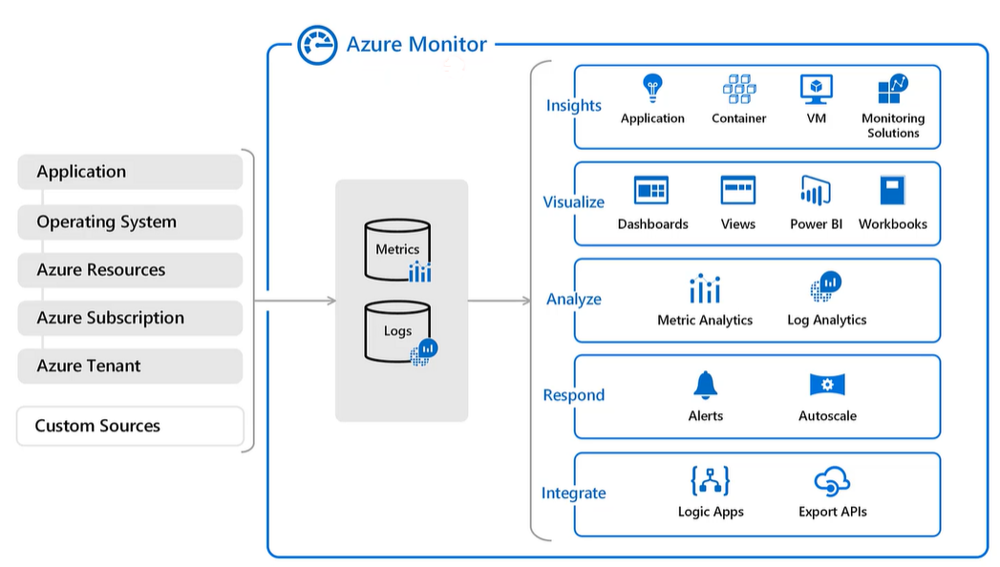

[My Microsoft Azure Home](microsoft_learn_home.md) 

# Azure Monitor Service

## Functionality

### Alerts

* Create custom alerts

### Metrics

* Create custom metrics

### Diagnostic Settings

* Create custom metrics

## Data Bricks

Databricks does not have native Azure alerts and metrics but other tools can be used for this purpose eg;
* Ganglia - built into Databricks
* Grafana - visualisation of time series (good for logs)
* Azure monitor - must install Log4j components

## Stream Analytics

### Metrics

* SU consumption - the resource measure for Stream Analytics
* Error monitoring
* Watermark delay - delay between the application event time and the time it was processed and displayed
* Input De-serialisation Errors - problems with the message
* Backlogged input event - job not keeping up with incoming messages

## Saving Logs

Three options to send your logs to;

* Log Analytics - then use Kusto query language (kql)
* Archive storage account - blob storage for cheap storage
* Event Hub

## Links

Microsoft Doco;

* [Monitor Data Factory Pipelines](https://docs.microsoft.com/en-us/azure/data-factory/monitor-using-azure-monitor)

* [Monitor Databricks](https://docs.microsoft.com/en-us/azure/databricks/administration-guide/account-settings/azure-diagnostic-logs)

* [Monitor Stream Analytics](https://docs.microsoft.com/en-us/azure/stream-analytics/stream-analytics-monitoring)
