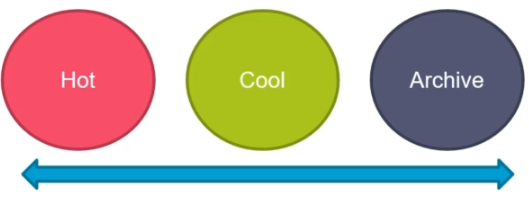

[My Microsoft Azure Home](microsoft_learn_home.md)

# Azure Storage Services

Types 

1. Queue Storage
2. Table Storage
3. File Storage
4. Blob Storage
    - Block blobs
    - Append Blobs
    - Page Blobs

## Azure Storage Data Redundancy

### Redundancy in Primary Region

* Locally redundant storage (LRS) - 3 copies in same data centre
* Zone redundant storage (ZRS) - 3 copies in 3 availability zones (AZs)

### Redundancy in Secondary Region

* Geo-redundant storage (GRS) - LRS + Asynchronous copy to secondary region
* Geo-zone-redundant storage (GZRS)

With GRS and GZRS the secondary region is available for read or write unless there is a failover.

For read access to secondary region use;
RA-GRS : read-access geo-redundant storage
RA_GZRS : read-access geo-zone-redundant storage

## Azure Access Storage Tiers

* Hot
* Cool
* Archive

## Azure Table Storage

## Queue Storage

## File Storage

## Links

