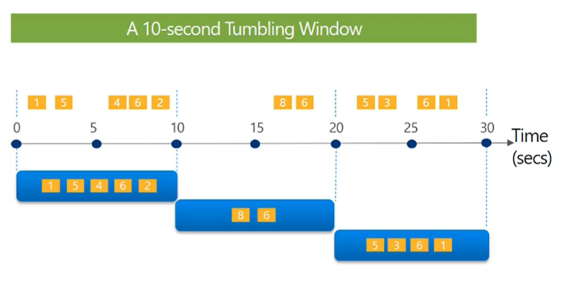
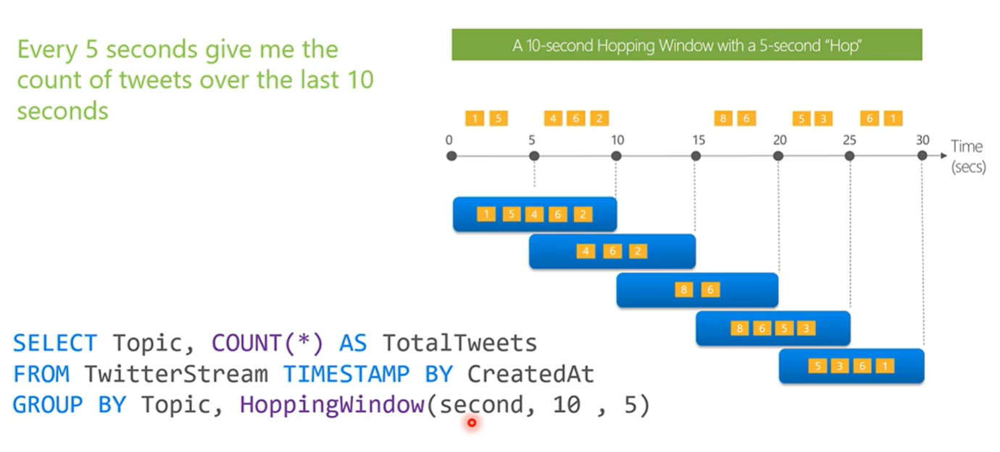
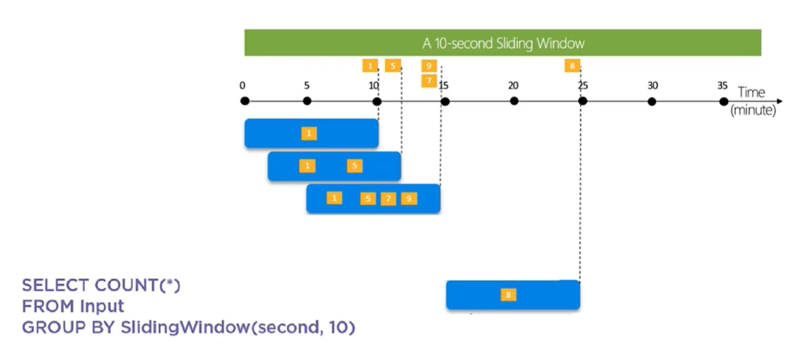
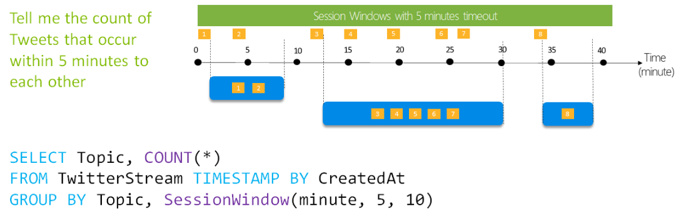

[My Microsoft Azure Home](microsoft_learn_home.md) > [Stream Analytics](azure_stream_analytics_windowing.md)

# Stream Analytics Windowing

There are four types of windowing;

* Tumbling Window
* Hopping Window
* Sliding Window
* Session Window

## 1. Tumbling Window

Tumbling windows are a series of fixed-sized, non-overlapping and contiguous time intervals.

Each event is only counted once.

However, they do not check the time duration between events and do not filter out periods of time when no events are streamed.

[Microsoft Docs : Tumbling Window](https://docs.microsoft.com/en-us/stream-analytics-query/tumbling-window-azure-stream-analytics)

## 2. Hopping Window

Hopping windows are a series of fixed-sized and contiguous time intervals. They hop forward by a specified fixed time. If the hop size is less than a size of the window, hopping windows overlap, and that is why an event may be part of several windows.

Hopping windows do not check the time duration between events and do not filter out periods of time when no events are streamed.

[Microsoft Docs : Hopping Window](https://docs.microsoft.com/en-us/stream-analytics-query/hopping-window-azure-stream-analytics)

## 3. Sliding Window

Sliding windows are a series of fixed-sized and contiguous time intervals. They produce output only when an event occurs, so you can filter out periods of times where no events are streamed.

However, they may overlap and that is why an event may be included in more than one window. Sliding windows also do not check the time duration between events.

[Microsoft Docs : Sliding Window](https://docs.microsoft.com/en-us/stream-analytics-query/sliding-window-azure-stream-analytics)

## 4. Session Window

Session windows begin when the defect detection event occurs, and they continue to extend, including new events occurring within the set time interval (timeout).

If no further events are detected, then the window will close. The window will also close if the maximum duration parameter is set for the session window, and then a new session window may begin.

The session window option will effectively filter out periods of time where no events are streamed. Each event is only counted once.

(Microsoft Docs : Session Window)[https://docs.microsoft.com/en-us/stream-analytics-query/session-window-azure-stream-analytics]

## Links

[Working with data streams in Azure Stream Analytics](https://docs.microsoft.com/en-us/learn/modules/introduction-to-data-streaming/)

[Configure Job Input](https://docs.microsoft.com/en-us/azure/stream-analytics/stream-analytics-define-inputs)

[Configure Job Output](https://docs.microsoft.com/en-us/azure/stream-analytics/stream-analytics-define-outputs)

[Select appropriate windowing functions](https://docs.microsoft.com/en-us/azure/stream-analytics/stream-analytics-window-functions)

[Transform data using Azure Stream Analytics](https://docs.microsoft.com/en-us/learn/modules/transform-data-with-azure-stream-analytics/)

[Work with streaming data in Azure Databricks](https://docs.microsoft.com/en-us/learn/modules/streaming-in-azure-databricks/)