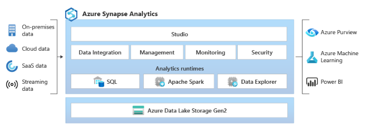
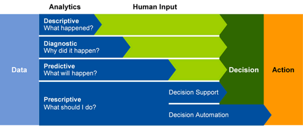
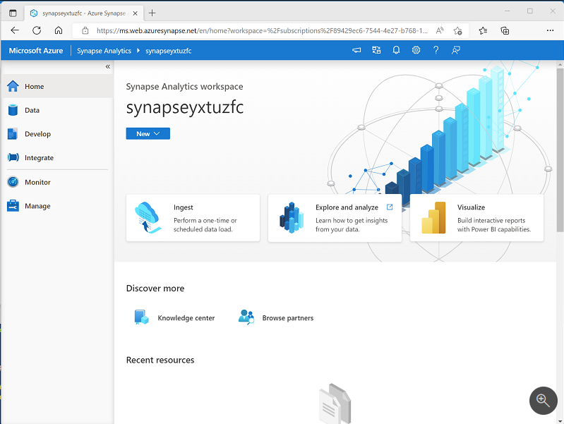
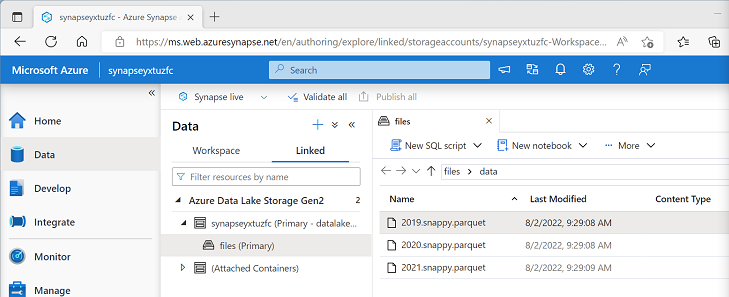
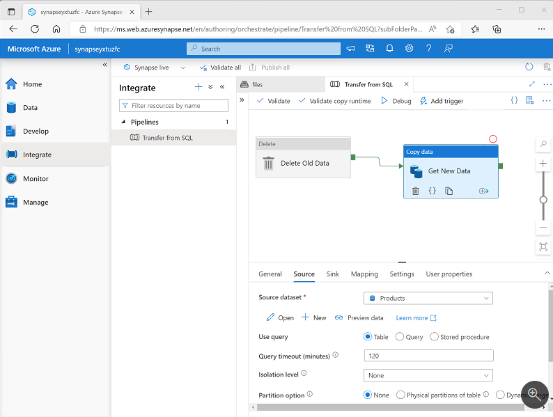
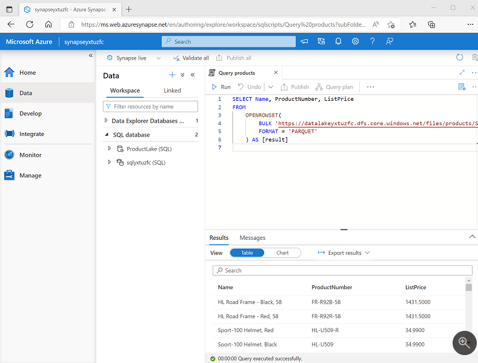
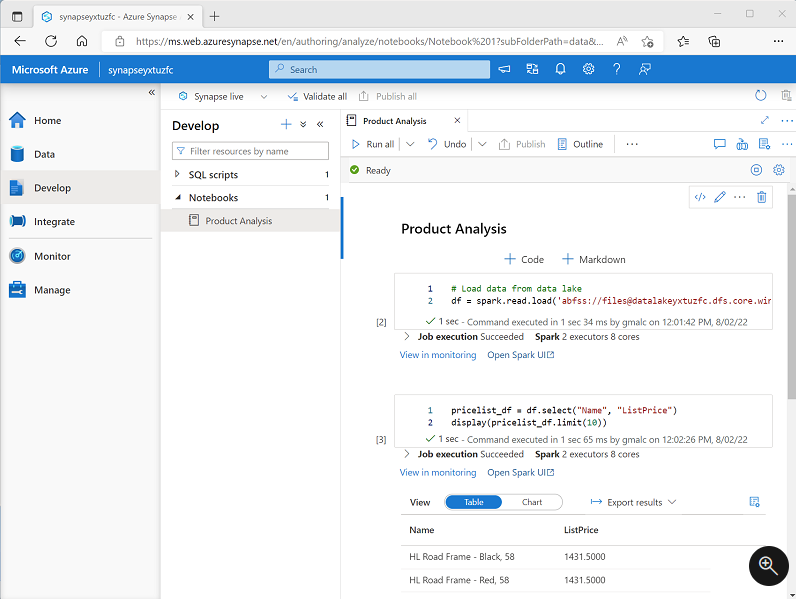
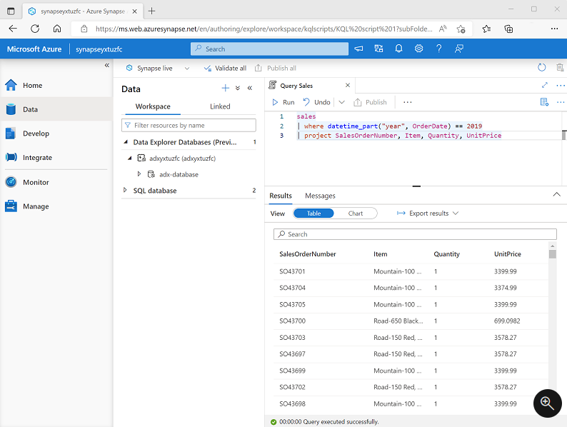

[My Microsoft Azure Home](microsoft_learn_home.md)

# Azure Synapse Analytics

## What is Azure Synapse

Synapse is the next generation of Azure SQL Data Warehouse, blending big data analytics, data warehousing and data integration into a single unified service that provides end-to-end analytics with limitless scale.

## What can it do?

Azure Synapse can provide solutions for all of the following types of analytics;

* **Descriptive Analytics** : Analysis of historical data typically in a data warehouse (What is happening)

* **Diagnostic Analytics** : Use of data warehouse and other sources to answer the question Why is it happening

* **Predictive Analytics** : What will happend based on previous trends and patterns

* **Prescriptive Analytics** : Autonomous decision making based on realtime or near realtime data

Azure Synapse provides a cloud based solution for all of the above types of analytics.

## How does it work? ##

It provides a centralised service to combine storage and processing together with an architecture that allows you to integrate data stores, processing platforms and visualisation tools.

### Creating and using an Azure Synapse Analytics workspace ###

Create a workspace using
* Azure Portal
* Azure Powershell
* Azure CLI
* Azure Resource Manager or Bicep template

Once this is created you can perform data analysis using Synapse Studio.

### Working with files in a data lake ###

One of the main resources of Synapse Analytics is a data lake and there is a default data lake which is implemented as a linked service to Azure Blob Storage Gen2 container.

### Ingesting and transforming data with pipelines ###

Synapse Analytics provides support for creating, running and managing pipelines that orchestrate activities.

### Querying and Manipulating data with SQL ###

### Processing and analysing data with Apache Spark ###

### Exporing Data with Data Explorer ###

