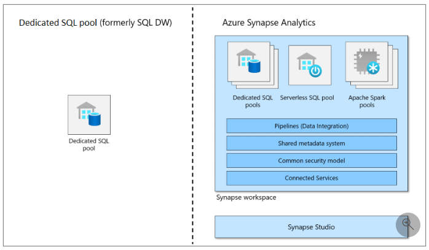

[Azure Synapse Home](azure_synapse_analytics.md)

# Azure Synapse : Dedicated SQL Pool (formerly SQL DW)

## Overview

Dedicated SQL pool (formerly known as SQL DW) represents a collection of analytic resources that are provisioned when using Synapse SQL. The size of a dedicated SQL pool is determined by Data Warehousing Unit (DWU).

## Links

* [Microsoft Learn : Dedicated SQL Pool](https://learn.microsoft.com/en-us/azure/synapse-analytics/sql-data-warehouse/sql-data-warehouse-overview-what-is?context=%2Fazure%2Fsynapse-analytics%2Fcontext%2Fcontext)

* [Microsoft Learn : Use Azure Synapse SQL Pool to query files in a data lake](https://learn.microsoft.com/en-us/training/modules/query-data-lake-using-azure-synapse-serverless-sql-pools/)