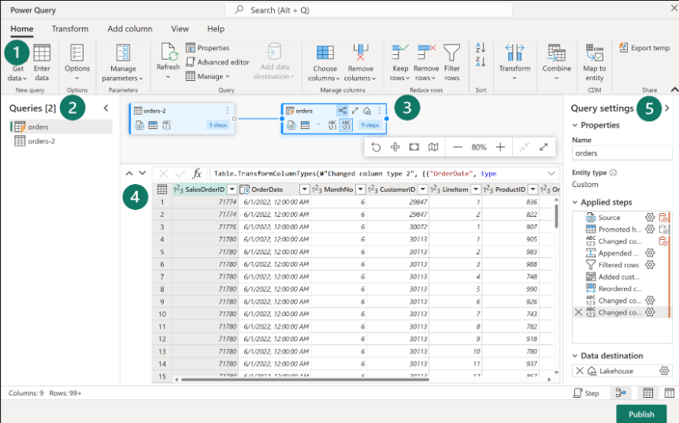
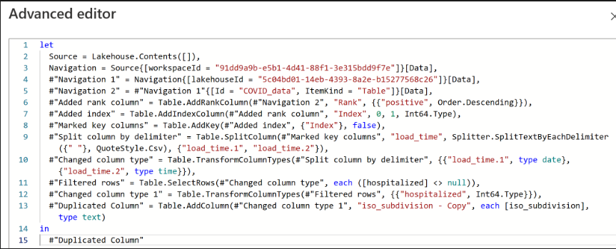

[Microsoft Learn Home](microsoft_learn_home.md) > [Fabric Learn Home](microsoft_fabric_learn_home.md)

# Data Flow Gen2

Ingest data with Dataflows Gen2 in Microsoft Fabric

## How to create

### In Data Factory

Dataflows Gen2 use Power Query Online to visualise transformations

Labels from the image above;
* 1. Power query ribbon
* 2. Queries pane - showing the data sources, now called queries
* 3. Diagram view - visualise connections
* 4. Data Preview pane
* 5. Query settings pane

### In Power BI workspace

